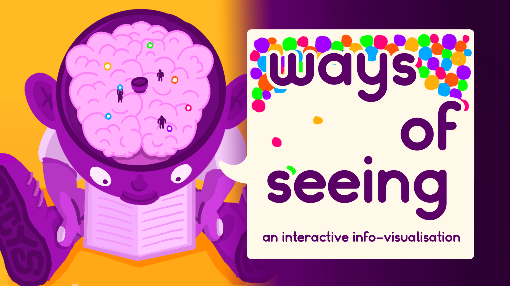

# Ways of Seeing - Interactive Info-visualization

An interactive visualization that explores John Berger's "Ways of Seeing" through dynamic particle systems and touch interactions.

## Overview

This project visualizes the text of "Ways of Seeing" by transforming words into colored particles that represent different types of perception. Each color corresponds to a specific type of perception mentioned in the text:

- 🟡 Yellow: Perception of Sight
- 🟠 Orange: Perception of Art
- 💗 Pink: Perception of Beauty
- 🟣 Purple: Perception of Images
- 🔵 Blue: Perception of Reality
- 💚 Green: Perception of Meaning

## Features

- **Text-to-Particle System**: Converts words from the essay into colored balls based on their perceptual categories
- **Interactive Elements**:
  - Touch/mouse-based particle manipulation
  - Draggable text and particles
  - Interactive title animation
  - Auto-cycling region highlights on touch devices
- **Responsive Design**: Adapts to different screen sizes and input methods
- **Sound Design**: Dynamic audio feedback for interactions

## Technical Details

- Built with p5.js and [p5play](https://p5play.org)
- Physics-based particle system with custom gravity
- Touch and mouse input handling
- Maximum 1000 particles with automatic cleanup
- Smooth transitions and animations

## Controls

- **Desktop**: Mouse hover and drag interactions
- **Touch Devices**:
  - Tap top third to trigger title animation
  - Drag particles anywhere on screen
  - Auto-cycling region highlights
- **Control Buttons**:
  - ⏯️ Play/Pause
  - 🔄 Speed control
  - 🔊 Sound toggle
  - 🔄 Reset (appears after title animation)

## More Information

Visit [doityourseph.com/#/projects/ways-of-seeing](https://doityourseph.com/#/projects/ways-of-seeing) for more details.

Made with p5.js and [p5play](https://p5play.org).
